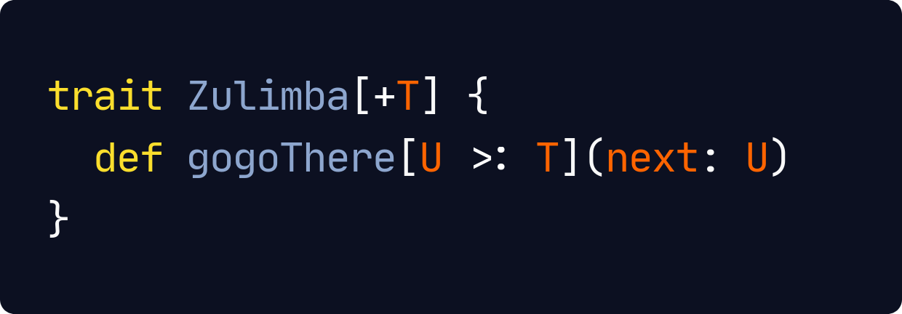

<!--
_class: lead
_paginate: false
_footer: ""
-->

# Why Did We Create Kotlin API for Apache Spark

Pasha Finkelshteyn, JetBrains

---

<!-- _class: lead -->
# Pasha Finkelshteyn

Developer :avocado: for Big Data @ JetBrains

@asm0di0

---

# How did I fall in love with Big Data?

- 7 years ago Hadoop looked like a magic to Java enterprise developer
- Started to look for data-related projects
- Started to read about DBs
- Moved from Team Lead to Data Engineer

---
<!-- _class: lead -->
# <!-- fit --> First thing Data Engineer learns?

---

---

# What did I have

- Java
- Kotlin
- Scala
- Groovy
- bash, XML, YAML :smile:

Sparse experience with other languages

---

# What did I have

- Core Java
- GC
- Lots of debug experience
- Distributed systems
- Architecture

---

# Supported languages

   

---
<!-- _class: lead -->
# 

### The most popular language in data engineering

---

---

---

---

---

# Python

* `F` is made to distinct Spark built-ins from self-made.
  Who have ever created their own function over column?
* API is untyped
* Everything is string-based
* `UDF`s are SLOW
* Custom type support is complex

---

---

# Python

---

<!-- _class: lead -->

# <!-- fit --> Scala

---

# The best* official API

- Typed and untyped APIs
- Awesome smart encoders
- Spark is written in Scala:
    - Best interop possible
- Huge ecosystem

<small>* by my own rating among official APIs</small>

---

# The hard parts

---

# The hard parts

---

# The hard parts

---

# The hard parts

- Hard to learn for people without JVM knowledge
- Hard to read code somebody else wrote
- Easy to abuse language features
    - operator overloading
    - implicit
    - traits

---
<!-- _class: lead -->
# Scala's type system is awesome and powerful!

---

<!-- _class: lead -->
# Scala's type system is awesome and powerful!

Yes, but even Spark doesn't utilize it's full power

---

<!-- _class: lead -->
# Scala's type system is awesome and powerful!

Yes, but even Spark doesn't utilize it's full power

For the greater good

---

